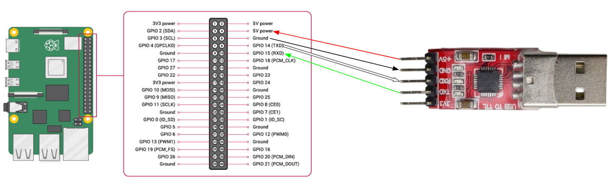

# Operating-Systems-Capstone
## Prerequisite
OS: MacOS

```brew install llvm qemu python3 pyserial```
## Running on RPI3
1. Build kernel
```
make kernel [TEST_PROG_NAME=<name>]
```
- Use `TEST_PROG_NAME` to compile specific test program under `testprog/` and put it into the ramdisk (default is `simple`)
2. Build UART bootloader
```
make bootloader
```
3. Move these file  into SD card:
- `bootloader.img`: bootloader image
    - Or move `kernel8.img` rather then `bootloader.img` and remove the line `kernel=bootloader.img` in `config.txt`, to boot with the kernel image directly 
- `initramfs.cpio`: ramdisk cpio archive
- `bcm2710-rpi-3-b-plus.dtb`: flattened devicetree
- `config.txt`: config file
4. Insert the SD card into RPI3, then power it on

5. Send the kernel image to UART bootloader
```
python3 send_kernel.py <tty-dev-path>
```
6. Interact with Rpi3
```
minicom -D <tty-dev-path> -b 115200 -o
``` 
## Test on QEMU
1. Build kernel
```
make kernel [TEST_PROG_NAME=<name>]
```
2. Build UART bootloader
```
make bootloader
```
3. Test
```
make test [_QEMUFLAGS=<additional flags>] [TARGET=<target>] [DISPLAY=true]
```
- `test` can be replaced with
    - `test-pty`: open a pseudo terminal
    - `test-asm`: dump the assembly
    - `test-int`: dump interrupts
    - For combined or other functions, add the flags in `<additional flags>`
- `<target>`: `kernel` (default) or `bootloader`
- Use `DISPLAY=true` to let QEMU display video output
4. Test with LLDB/GDB (optional)
```
make debug _QEMUFLAGS=<additional flags> TARGET=<target> 
```
- GDB
```
gdb <target>.elf
target remote :1234
```
- LLDB
```
lldb <target>.elf
gdb-remote 1234
```